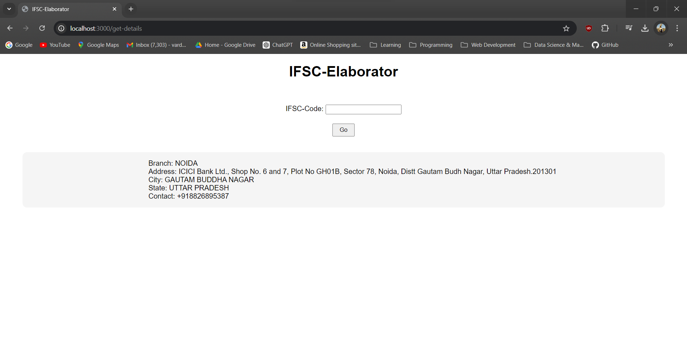

# IFSC-Elaborator

IFSC-Elaborator is a simple Node.js application that allows users to retrieve detailed information about a bank branch using its IFSC code. The app fetches data from the Razorpay IFSC API and displays the branch details on a webpage. 



## Features
Users can enter an IFSC code in the input field.
The application sends a request to the Razorpay IFSC API and fetches branch details.
The branch details are then displayed on the same webpage.

## Prerequisites
Make sure you have the following installed on your machine:

- Node.js (version 12 or higher)
- npm (Node package manager, usually comes with Node.js)

# Installation
Follow these steps to set up and run the application:

Clone the repository:

```bash
git clone https://github.com/vardanskamra/web-dev-bootcamp-capstone-1
cd web-dev-bootcamp-capstone-1
```

Install dependencies:

```bash
npm install
```
Run the application:

```bash
npm start
```
Open your browser and go to http://localhost:3000 to see the app in action.

## How It Works
### Frontend:

The user is presented with a simple form where they can enter an IFSC code.
Upon submission, the form sends a POST request to the server.

### Backend:

The server receives the IFSC code from the form and sends a GET request to the Razorpay IFSC API.
The API responds with branch details, which are then passed to the frontend and displayed to the user.

## Dependencies
- express: A web application framework for Node.js.
- axios: A promise-based HTTP client for making API requests.
- body-parser: Middleware to parse the incoming request bodies.


## License
This project is licensed under the MIT License - see the [LICENSE](./LICENSE.txt) file for details.